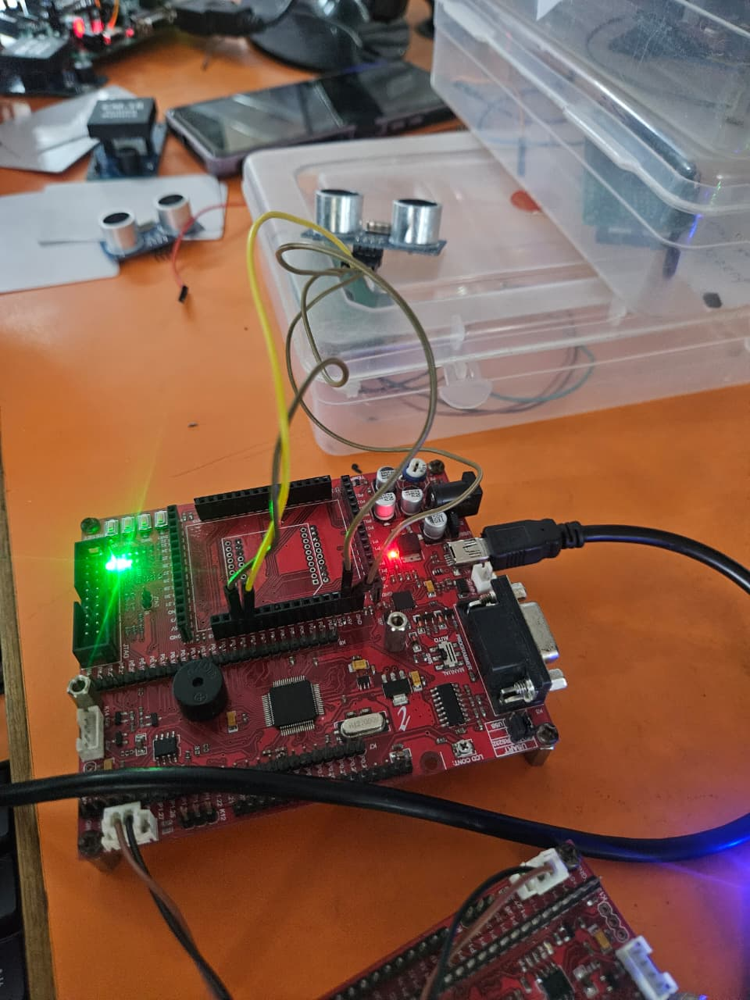
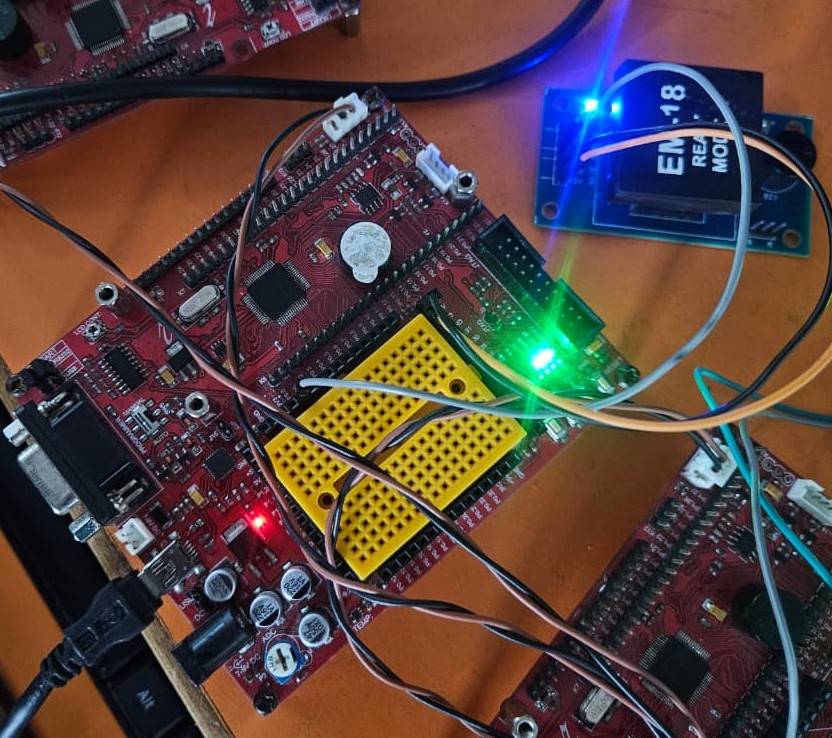
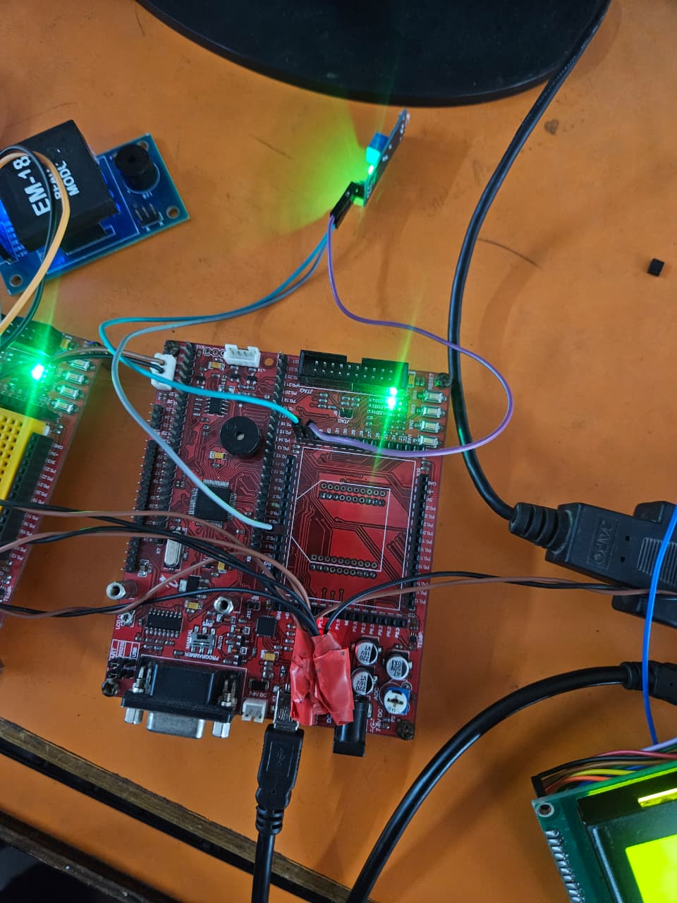
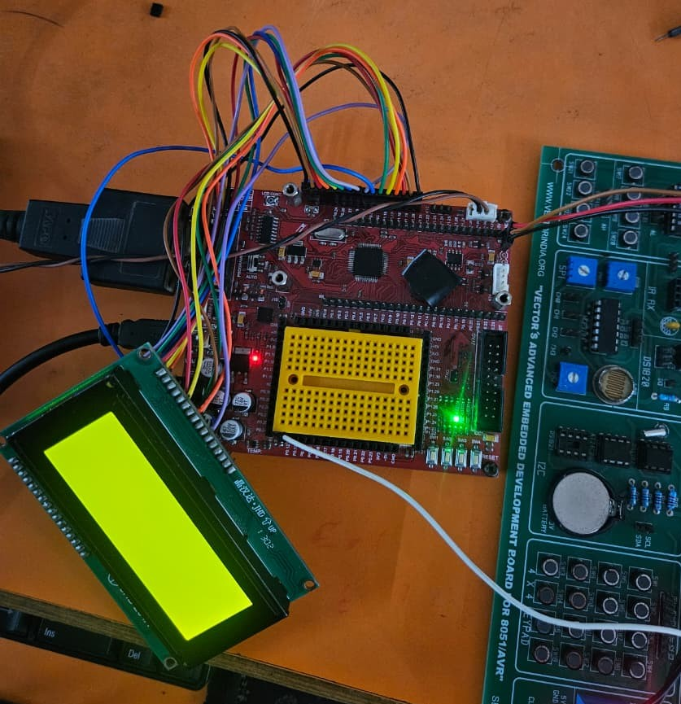

# 🚧 Distributed CAN-Enabled Industrial Safety & Monitoring System using ARM7

## 📌 Overview
This project implements a distributed multi-node industrial safety and monitoring system using **ARM7 microcontrollers** communicating over the **CAN (Controller Area Network)** protocol. The system enhances worker safety by enabling access authorization, environment-based automation, hazard detection, and central machine control.

---

## 🎯 Objective
- To prevent unauthorized machine operation in industrial environments.
- To enable real-time safety automation through distributed sensing and monitoring.
- To implement a reliable CAN communication network enabling coordinated safety responses.
- To improve workplace safety, visibility, and accident prevention through automatic control actions.

---

## 🛠 Solution
A **four-node embedded architecture** was developed using ARM7 controllers interconnected via the CAN bus:

### **🔹 Node 1 – RFID Authorization**
- Validates operator identity using RFID tags
- Sends authorization status via CAN
- Prevents unauthorized machine activation

### **🔹 Node 2 – Environmental Monitoring & Lighting Control**
- Monitors ambient lighting using an LDR sensor
- Automatically controls lighting based on environment
- Sends environmental updates via CAN

### **🔹 Node 3 – Proximity Hazard Detection**
- Uses ultrasonic sensor to detect unsafe distance from machinery
- Sends emergency stop signal through CAN
- Automatically stops machine operation to prevent accidents

### **🔹 Node 4 – Central Monitoring & Machine Control**
- Acts as Master node with LCD display
- Receives status and safety commands from all nodes
- Controls machine ON/OFF based on system state

---

## 📡 CAN Communication
- Distributed coordination using message arbitration and priority
- Real-time safety response and signaling
- Scalable and fault-tolerant system architecture

---

## 🧾 Outcome
- Successfully prevented unsafe machine usage and responded automatically to hazardous conditions.
- Achieved real-time synchronized operation between nodes using CAN.
- Demonstrated improved safety automation through RFID authentication, lighting control, and emergency shutdown.
- Hands-on experience gained in:
  - ARM7 embedded programming
  - CAN protocol communication
  - Sensor interfacing and hardware integration
  - Industrial automation and control fundamentals

---

## 📐 System Architecture
Node1 (RFID) ─┐
Node2 (Env) ──┼── CAN Bus ── Node4 (Master + LCD + Machine Control)
Node3 (Safety)┘

---

## 🧰 Technologies Used
|------------------|------------------------------------|
| Category         | Details                            |
|------------------|------------------------------------|
| Microcontroller  | ARM7 LPC series                    |
| Communication    | CAN protocol using MCP2551         |
| Sensors          | RFID, Ultrasonic, LDR              |
| Display          | LCD 20x4                           |
| Software Tools   | Keil µVision, Proteus, Flash Magic |
| Control Hardware | Motor driver + DC motor            |
|------------------|------------------------------------|

---

## 📷 Project Images
|---------------------------------------------------------|
| Full Hardware Setup                                     |
|---------------------------------------------------------|
|               |
|---------------------------------------------------------|
| Node 1 – RFID              | Node 2 – Environment       |
|----------------------------|----------------------------|
|  |  |

| Node 3 – Safety            | Node 4 – Master LCD        |
|----------------------------|----------------------------|
|  |  |

---

## 🚀 Future Enhancements
- IoT / cloud dashboard for monitoring
- CAN-FD upgrade for higher bandwidth
- Real-time data logging and analytics
- Wireless node expansion

---

## 👤 Author
**Goutham Gandhi S**  
Embedded Systems & Automotive Electronics Enthusiast 
---

## ⭐ Support
If you found this project helpful, please ⭐ the repository and connect with me on LinkedIn!
